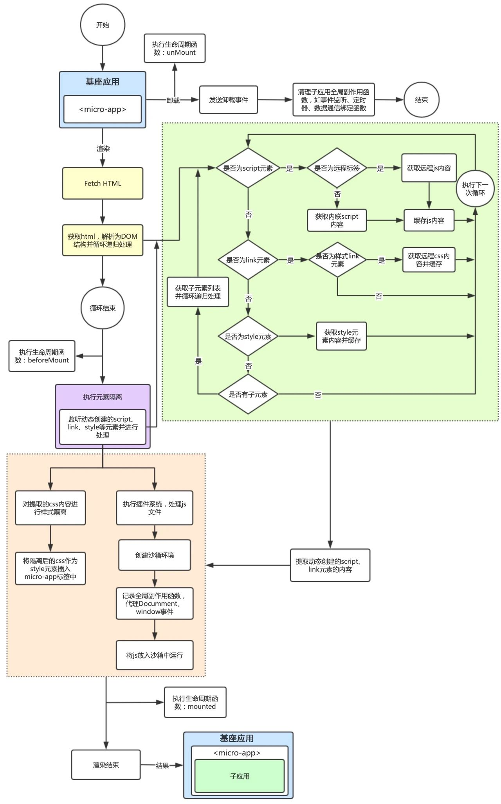
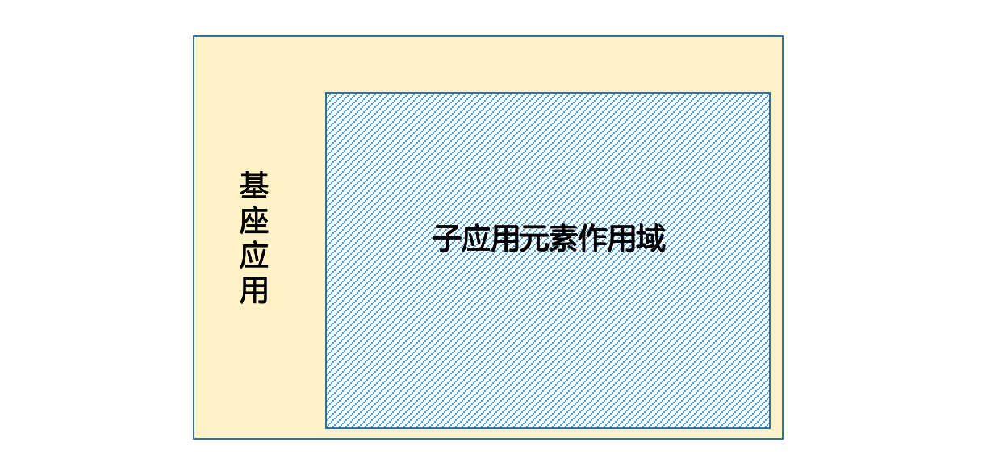
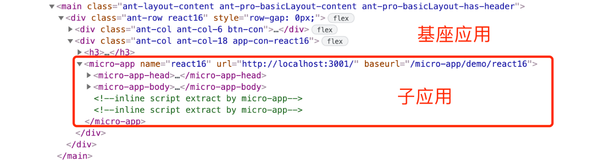
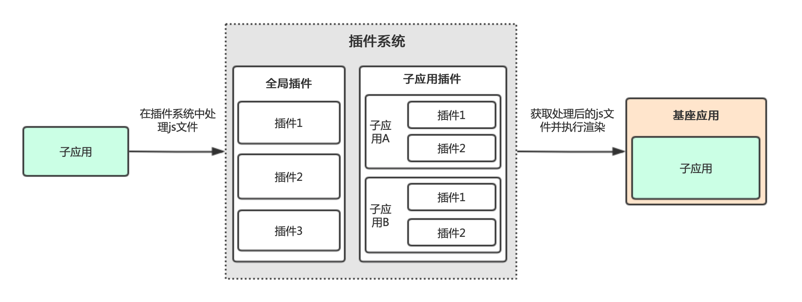
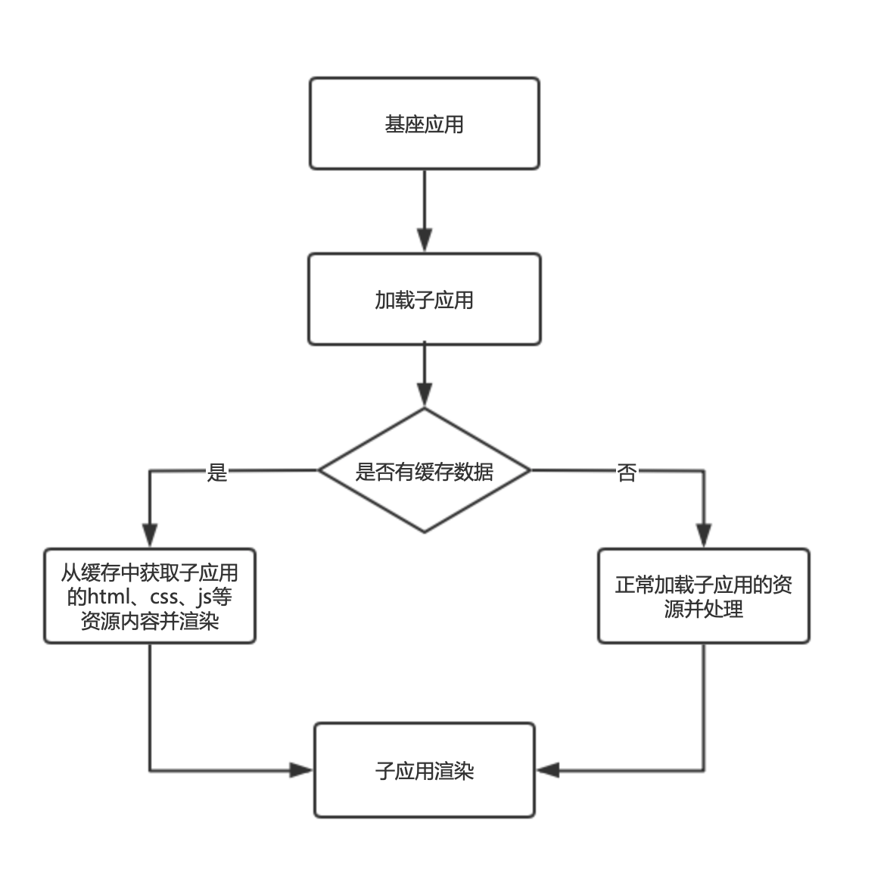
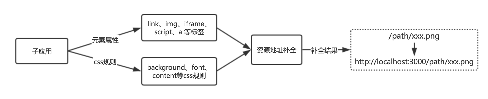
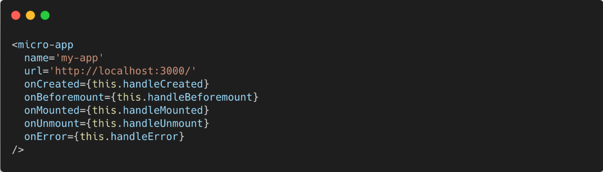
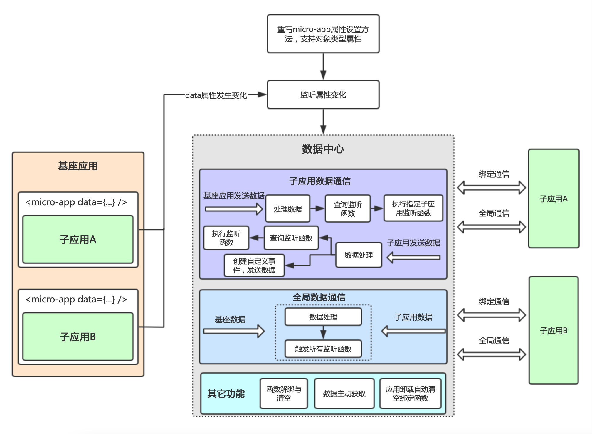

# 微前端框架 micro-app


## 什么是micro-app
Micro App 是由京东零售iPaaS前端研发团队推出的一款微前端框架，不同于目前流行的开源框架，它从组件化的思维实现微前端，旨在降低上手难度、提升工作效率。它是目前市场上接入微前端成本最低的方案，并且提供了js沙箱、样式隔离、元素隔离、预加载、资源地址补全、插件系统、数据通信等一系列完善的功能。Micro App与技术栈无关，也不和业务绑定，可以用于任何前端框架和业务

## 为什么不是qiankun

qiankun虽然优秀，但依然无法满足我们的预期。第一个问题是在我们实际使用场景中，每个接入微前端的项目运行已久，且每个项目由不同的人员和团队负责，如何降低对源代码的侵入性，减少代码修改和沟通成本，这是我们非常关心的点，所以我们需要一种比qiankun接入成本更小的方案。第二个问题是在多方应用接入的情况 下，沙箱并不能完美规避所有问题(比如子午线的埋点冲突问题)，但qiankun并没有提供处理此类不可预料的问题的能力。在不停的摸索中，我们找到一种极致简洁的实现思路，它像使用组件一样简单，只修改一点点代码就可以接入微前端，并且还提供插件系统，赋予开发者灵活处理问题的能力。

## qiankun 与 micro-app 相关数据对比

|                       | qiankun               | micro-app             |
|------------------     |---------------------- | ----------------------|
|Github stars           | 12.7k                 | 2.7k                  |
|First release date     | 2019-08-01            | 2021-06-09            |
|Releases               | 114                   | 29                    |
|Last release date      | 2022-5-30(v2.7.2)     | 2022-2-14(v0.8.5)     |
|Weekly Downloads(npm)  | 494                   | 9068                  |
|Least publish(npm)     | 9 days ago            | 4 months ago          |


## micro-app有什么优势?

single-spa是通过监听 url change 事件，在路由变化时匹配到渲染的子应用并进行渲染，这个思路也是目前实现微前端的主流方式。同时single-spa要求子应用修改渲染逻辑并暴露出三个方法：bootstrap、mount、unmount，分别对应初始化、渲染和卸载，这也导致子应用需要对入口文件进行修改。因为qiankun 是基于single-spa进行封装，所以这些特点也被qiankun继承下来，并且需要对webpack配置进行一些修改。

micro-app并没有沿袭single-spa的思路，而是借鉴了WebComponent的思想，通过CustomElement结合自定义的ShadowDom，将微前端封装成一个类WebComponent组件，从而实现微前端的组件化渲染。并且由于自定义ShadowDom的隔离特性，micro-app不需要像single-spa和qiankun一样要求子应用修改渲染逻辑并暴露出方法，也不需要修改webpack配置，是目前市面上接入微前端成本最低的方案，并且提供了js沙箱、样式隔离、元素隔离、预加载、资源地址补全、插件系统、数据通信等一系列完善的功能。

HTML Entry：是指设置html作为资源入口，通过加载远程html，解析其DOM结构从而获取js、css等静态资源来实现微前端的渲染，这也是qiankun目前采用的渲染方案。

WebComponent：web原生组件，它有两个核心组成部分：CustomElement和ShadowDom。CustomElement用于创建自定义标签，ShadowDom用于创建阴影DOM，阴影DOM具有天然的样式隔离和元素隔离属性。由于WebComponent是原生组件，它可以在任何框架中使用，理论上是实现微前端最优的方案。但WebComponent有一个无法解决的问题 - ShadowDom的兼容性非常不好，一些前端框架在ShadowDom环境下无法正常运行，尤其是react框架。

类WebComponent：就是使用CustomElement结合自定义的ShadowDom实现

WebComponent基本一致的功能。

由于ShadowDom存在的问题，我们采用自定义的样式隔离和元素隔离实现ShadowDom类似的功能，然后将微前端应用封装在一个CustomElement中，从而模拟实现了一个类WebComponent组件，它的使用方式和兼容性与WebComponent一致，同时也避开了ShadowDom的问题。并且由于自定义ShadowDom的隔离特性，Micro App不需要像single-spa和qiankun一样要求子应用修改渲染逻辑并暴露出方法，也不需要修改webpack配置。


我们通过上述方案封装了一个自定义标签 micro-app ，它的渲染机制和功能与WebComponent类似，开发者可以像使用web组件一样接入微前端。它可以兼容任何框架，在使用方式和数据通信上也更加组件化，这显著降低了基座应用的接入成本，并且由于元素隔离的属性，子应用的改动量也大大降低。


## 核心原理
Micro App 的核⼼功能在CustomElement基础上进⾏构建，CustomElement⽤于创建⾃定义标签，并提供了元素的渲染、卸载、属性修改等钩⼦函数，我们通过钩⼦函数获知微应⽤的渲染时机，并将⾃定义标签作为容器，微应⽤的所有元素和样式作⽤域都⽆法逃离容器边界，从⽽形成⼀个封闭的环境。


## 渲染流程
通过⾃定义元素micro-app 的⽣命周期函connectedCallback 监听元素被渲染，加载⼦应⽤的html并转换为DOM结构，递归查询所有js和css等静态资源并加载，设置元素隔离，拦截所有动态创建的script、link等标签，提取标签内容。将加载的js经过插件系统处理后放⼊沙箱中运⾏，对css资源进⾏样式隔离，最后将格式化后的元素放⼊micro-app 中，最终micro-app 元素渲染为⼀个微前端的⼦应⽤。在渲染的过程中，会执⾏开发者绑定的⽣命周期函数，⽤于进⼀步操作。



## 元素隔离

元素隔离源于ShadowDom的概念，即ShadowDom中的元素可以和外部的元素重复但不会冲突，ShadowDom只能对⾃⼰内部的元素进⾏操作。

Micro App模拟实现了类似的功能，我们拦截了底层原型链上元素的⽅法，保证⼦应⽤只能对⾃⼰内部的元素进⾏操作，每个⼦应⽤都有⾃⼰的元素作⽤域。

元素隔离可以有效的防⽌⼦应⽤对基座应⽤和其它⼦应⽤元素的误操作，常⻅的场景是多个应⽤的根元素都使⽤相同的id，元素隔离可以保证⼦应⽤的渲染框架能够正确找到⾃⼰的根元素。

 
  


如上图所示， micro-app 元素内部渲染的就是⼀个⼦应⽤，它还有两个⾃定义元素micro-app-head 、micro-app-body ，这两个元素的作⽤分别对应html中的head和body元素。⼦应⽤在原head元素中的内容和⼀些动态创建并插⼊head的link、script元素都会移动到micro-app-head 中，在原body元素中的内容和⼀些动态创建并插⼊body的元素都会移动到micro-app-body 中。这样可以防⽌⼦应⽤的元素泄漏到全局，在进⾏元素查询、删除等操作时，只需要在micro-app 内部进⾏处理，是实现元素隔离的重要基础。

可以将micro-app 理解为⼀个内嵌的html⻚⾯，它的结构和功能都和html⻚⾯类似。


## 插件系统

微前端的使⽤场景⾮常复杂，即便有沙箱机制也⽆法避免所有的问题，所以我们提供了⼀套插件系统⽤于解决⼀些⽆法预知的问题。

插件可以理解为符合特定规则的对象，对象中提供⼀个函数⽤于对资源进⾏处理，插件通常由开发者⾃定义。

插件系统的作⽤是对传⼊的静态资源进⾏初步处理，并依次调⽤符合条件的插件，将初步处理后的静态资源作为参数传⼊插件，由插件对资源内容进⼀步的修改，并将修改后的内容返回。插件系统赋予开发者灵活处理静态资源的能⼒，对有问题的资源⽂件进⾏修改。

插件系统本身是纯净的，不会对资源内容造成影响，它的作⽤是统筹各个插件如何执⾏，当开发者没有设置插件时，则传⼊和传出的内容是⼀致的。




## js沙箱和样式隔离 

js沙箱通过Proxy代理⼦应⽤的全局对象，防⽌应⽤之间全局变量的冲突，记录或清空⼦应⽤的全局副作⽤函数，也可以向⼦应⽤注⼊全局变量⽤于定制化处理。

样式隔离是指对⼦应⽤的link和style元素的css内容进⾏格式化处理，确保⼦应⽤的样式只作⽤域⾃身，⽆法影响外部。

Micro App借鉴了qiankun的js沙箱和样式隔离⽅案，这也是⽬前应⽤⼴泛且成熟的⽅案。

## 预加载 

Micro App 提供了预加载⼦应⽤的功能，它是基于requestIdleCallback实现的，预加载不会对基座应⽤和其它⼦应⽤的渲染速度造成影响，它会在浏览器空闲时间加载应⽤的静态资源，在应⽤真正被渲染时直接从缓存中获取资源并渲染。



## 资源地址补全 
微前端中经常出现资源丢失的现象，原因是基座应⽤将⼦应⽤的资源加载到⾃⼰的⻚⾯渲染，如果⼦应⽤的静态资源地址是相对地址，浏览器会以基座应⽤所在域名地址补全静态资源，从⽽导致资源丢失。

资源地址补全就是将⼦应⽤静态资源的相对地址补全为绝对地址，保证地址指向正确的资源路径，这种操作类似于webpack在运⾏时设置publicPath。



## 生命周期 
在微应⽤渲染时， micro-app 在不同渲染阶段会发送不同的⽣命周期事件，基座应⽤可以通过监听事件来进⾏相应的操作。



⽣命周期列表：

- created：当micro-app标签被创建后，加载资源之前执⾏。

- beforemount：资源加载完成，正式渲染之前执⾏。

- mounted：⼦应⽤已经渲染完成后执⾏

- unmount：⼦应⽤卸载时执⾏。

- error：当出现破坏性错误，⽆法继续渲染时执⾏。

在卸载时，⼦应⽤也会接收到⼀个卸载的事件，⽤于执⾏卸载相关操作。

## 数据通信

数据通信是微前端中⾮常重要的功能，实现数据通信的技术⽅案很多，优秀的⽅案可以提升开发效率，减少试错成本。我们也研究了qiankun等微前端框架数据通信的⽅式，但他们的实现⽅式并不适合我们，我们尝试直接通过元素属性传递复杂数据的形式实现数据通信。

对于前端研发⼈员最熟悉的是组件化的数据交互的⽅式，⽽⾃定义元素micro-app作为类WebComponent，通过组件属性进⾏数据交互必然是最优的⽅式。但MicroApp在数据通信中遇到的最⼤的问题是⾃定义元素⽆法⽀持设置对象类型属性，例如<micro-app data={x: 1}></micro-app> 会转换为 <micro-app data='[object Object]'></micro-app> ，想要以组件化形式进⾏数据通信必须让元素⽀持对象属性。

为了解决这个问题，我们重写了micro-app 元素原型链上属性设置的⽅法，在micro-app 元素设置对象属性时将传递的值保存到数据中⼼，通过数据中⼼将值分发给⼦应⽤。

Micro App中数据是绑定通信的，即每个micro-app 元素只能与⾃⼰指向的⼦应⽤进⾏通信，这样每个应⽤都有着清晰的数据链，可以避免数据的混乱，同时Micro App也⽀持全局通信，以便跨应⽤传递数据。



## 如何接入 micro-app 

### 基座应用  


- 安装依赖   


```

    npm i @micro-zoe/micro-app --save

```

- 在入口处引入

```
    
    import microApp from '@micro-zoe/micro-app'

    microApp.start()
```

- 在页面中嵌入子应用 


```

<!-- my-page.vue -->
<template>
  <div>
    <h1>子应用</h1>
    <!-- 
      name(必传)：应用名称
      url(必传)：应用地址，会被自动补全为http://localhost:3000/index.html
      baseroute(可选)：基座应用分配给子应用的基础路由，就是上面的 `/my-page`
     -->
    <micro-app name='app1' url='http://localhost:3000/' baseroute='/my-page'></micro-app>
  </div>
</template> 


```

## 子应用

- 在vue.config.js中添加配置
```
devServer: {
  headers: {
    'Access-Control-Allow-Origin': '*',
  }
}
```

- 设置基础路由(如果基座是history路由，子应用是hash路由，这一步可以省略) 

```

// main.js
import VueRouter from 'vue-router'
import routes from './router'

const router = new VueRouter({
  mode: 'history',
  // 👇 __MICRO_APP_BASE_ROUTE__ 为micro-app传入的基础路由
  base: window.__MICRO_APP_BASE_ROUTE__ || process.env.BASE_URL,
  routes,
})
```

- 设置 publicPath   

这一步借助了webpack的功能，避免子应用的静态资源使用相对地址时加载失败的情况，详情参考webpack文档 publicPath

如果子应用不是webpack构建的，这一步可以省略。

步骤1: 在子应用src目录下创建名称为public-path.js的文件，并添加如下内容
```
// __MICRO_APP_ENVIRONMENT__和__MICRO_APP_PUBLIC_PATH__是由micro-app注入的全局变量
if (window.__MICRO_APP_ENVIRONMENT__) {
  // eslint-disable-next-line
  __webpack_public_path__ = window.__MICRO_APP_PUBLIC_PATH__
}
```

步骤2: 在子应用入口文件的最顶部引入public-path.js
```
// entry
import './public-path
```

- 监听卸载  

子应用被卸载时会接受到一个名为unmount的事件，在此可以进行卸载相关操作。

```
// main.js
const app = new Vue(...)

// 监听卸载操作
window.addEventListener('unmount', function () {
  app.$destroy()
})
```