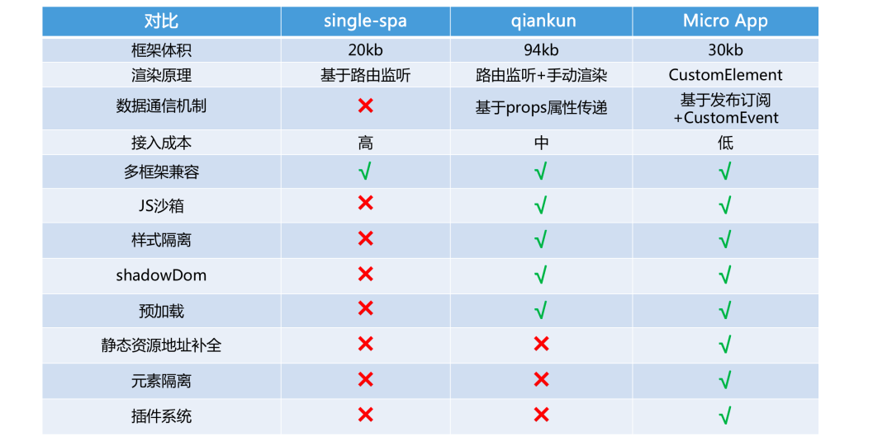
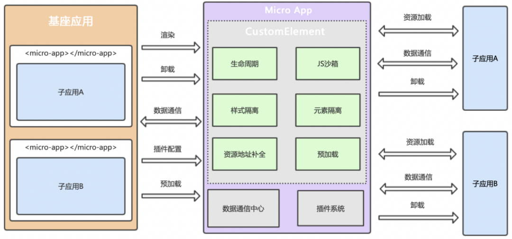

# 微前端框架 qiankun VS micro-app

## 相关数据对比

|                       | qiankun               | micro-app             |
|------------------     |---------------------- | ----------------------|
|Github stars           | 12.7k                 | 2.7k                  |
|First release date     | 2019-08-01            | 2021-06-09            |
|Releases               | 114                   | 29                    |
|Last release date      | 2022-5-30(v2.7.2)     | 2022-2-14(v0.8.5)     |
|Weekly Downloads(npm)  | 494                   | 9068                  |
|Least publish(npm)     | 9 days ago            | 4 months ago          |

## micro-app有什么优势?

single-spa是通过监听 url change 事件，在路由变化时匹配到渲染的子应用并进行渲染，这个思路也是目前实现微前端的主流方式。同时single-spa要求子应用修改渲染逻辑并暴露出三个方法：bootstrap、mount、unmount，分别对应初始化、渲染和卸载，这也导致子应用需要对入口文件进行修改。因为qiankun 是基于single-spa进行封装，所以这些特点也被qiankun继承下来，并且需要对webpack配置进行一些修改。

micro-app并没有沿袭single-spa的思路，而是借鉴了WebComponent的思想，通过CustomElement结合自定义的ShadowDom，将微前端封装成一个类WebComponent组件，从而实现微前端的组件化渲染。并且由于自定义ShadowDom的隔离特性，micro-app不需要像single-spa和qiankun一样要求子应用修改渲染逻辑并暴露出方法，也不需要修改webpack配置，是目前市面上接入微前端成本最低的方案，并且提供了js沙箱、样式隔离、元素隔离、预加载、资源地址补全、插件系统、数据通信等一系列完善的功能。

